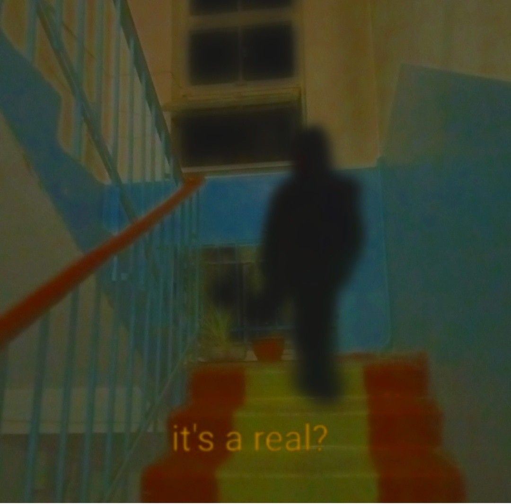
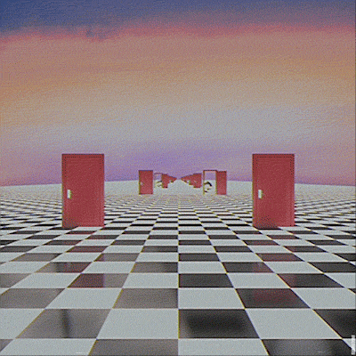

# Game Design Document - project 02
## 0.Credits and others
### credits
Oben  Yozgyur  @oben     Programmer    

Wanqiu  Lin  @kelerm     Game designer, 2D Artist   

Mico  Mendoza  @frico    Programmer   

Jiayi  Li  @Jiayi Li     Game designer, 2D Artist/3D Artist   

### Estimate work hours : 90h
### Tools and Software
	- Unity  
 	- Photoshop
  	- figma
   	- 3dsMax
   	- miro
### Resources
	- font : https://www.1001freefonts.com/bighter.font
 	- sound effect : https://www.aigei.com/view/121430-45337956.html
  	- back ground music : https://pixabay.com/music/mystery-tense-horror-background-174809/
## 1.Game Name 
Crossing the Liminal

## 2.Game Overview

### 2.1.Game Concept - missing
Our poor doll is missing in a liminal back room where some walls are coming torward it. The only choice to survive is to get into the darkness through the door. while keeping go through the liminal spaces, watch out not to miss out certain parts behind!
1. What is missing?
      - MC themselves in  liminal space etc
      - MC's body part
2. What player need to do with the missing?
      - maintain as long as possible
3. Can the missing be fixed? How?
      - No. 

### 2.2.Genre
      action game 
        -dodging (and perhaps shooting)
		

### 2.3.Projection (Camera view)
    3D third person view back view

   

### 2.4.Look and Feel –What is the basic look and feel of the game? What is the visual style?
- dreamcore /dizzy /empty and hollow
- something New Weird style like H.P. Lovecraft's stories
- 90's old picture nostalgia

## 3.Gameplay and Mechanics

### 3.1.Gameplay

#### 3.1.1.Game Progression
      The player need to separately control the four limbs of the voodoo doll to move and change gesture to match the black shape on the wall. If some body part of the doll doesn't fit, it will be detached from the doll and left in the previous room. If the all components are apart. The game ends.
      

### 3.2.Mechanics
#### 3.2.1.Physics –How does the physical universe work?
 The player is in closed back rooms where the only way out is the black area from a bunch of continual walls that keep pressing in.

#### 3.2.2.Movement
      Players can move sideways in the room

#### 3.2.3.Objects–how to pick them up and move them
      There might be mushrooms on the floor, player can pick and throw them toward the wall to break it and make the black area larger and have more chances to  survive.
      
#### 3.2.4.Actions
      - move to left or right
      - adjust the position of limbs and head
      - pick up mushrooms and throw them

## 4.Story, Setting and Character

### 4.1.Story and Narrative 
      Our poor doll is missing in a liminal back room where some walls are coming torward it. With no other choice, it made its way to the darkened door

### 4.2.Game World
      A dreamlike empty and silent back room with wired lights and unnatural vibe. It's obviously very creepy but it gives a strange sense of familiarity and nostalgia.

### 4.3.Characters.
      This wretched rag doll is like a personality projection of each of us in childhood. We cannot establish a direct dialogue with ourselves. We can only feel our inner self when facing something that tends to be intuitive, or even in a specific imprisoned situation. What we are really obsessed with is being able to truly feel The wonderful physical and mental feeling when you are inside and outside yourself is a sense of freedom under the shackles of imprisonment. We all expect a 'strange thing' or an 'unknown thing', and it has the image of a 'monster', but in fact, this 'monster' is precisely our inner self. This mirror that illuminates our inner self reflects our confusion, pain, happiness, sadness, and even death at a certain period. We linger in that barren land without any meaning in order to awaken And recalling the process of moving from confinement to freedom, what we yearn for is the moment of getting in touch with our hearts, and returning to a state similar to the mother's body.

## 5.Levels

The level will change and adjust when the body part of the doll is missed. If the doll has all body part, black area is around that size, similarly when doll has only three limb and a head, the black area will be smaller to be a challenge for three limbs.

## 6.UI/UX

### 6.1.Visual System.  (menus) 
      a main menu  
      a pause menu

### 6.2.Control System (commands and input)
      a - move left arm
      s - move left leg
      d - move right leg
      f - move right arm
      mouse left click - move to left
      mouse right click - move to right
      space - pick up mushroom and throw it 

### 6.3.Audio, music, sound effects
      - bgm
            -dream core style loop music 
            e.g.'it's just a burning memory'
      - sound affect 
            feedback: 1.getting through hint
                      1. miss and cut hint
                      2. collect hint
                      3. menu click sound

## 8.Technical

### 8.1.Target Hardware
       pc

### 8.2.Development software
      - Unity
      - Figma
      - Photoshop
      - 3DsMax

## 9.Game Art  assets, how they are being developed.  Intended style.
      voodoo doll 
      mushroom 
      walls and rooms

